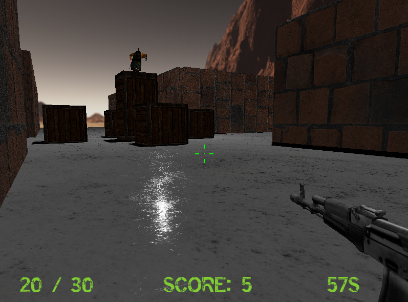
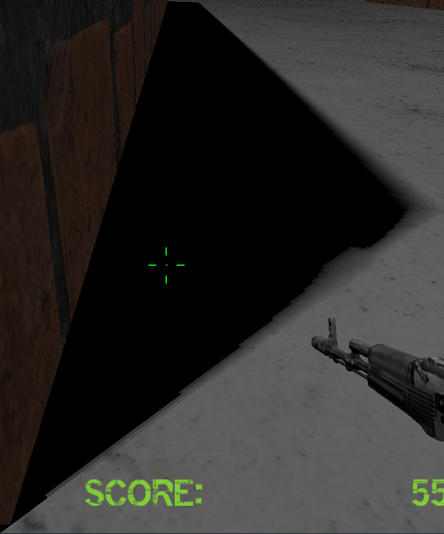
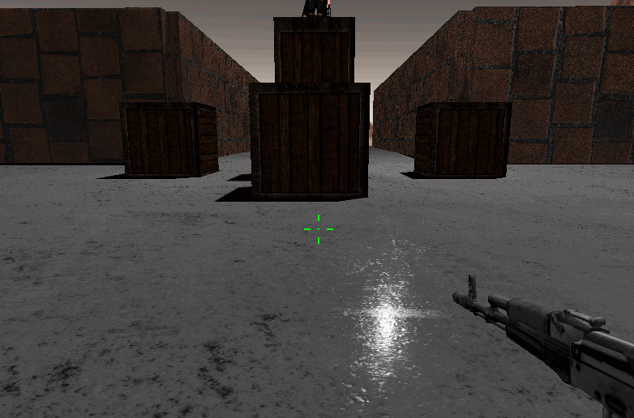
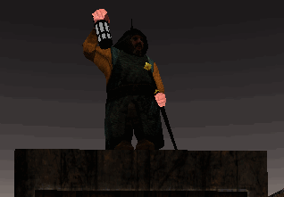

# FPS-game

SYSU CG final project - Team 15

Thanks to the contributors [James-Yip](https://github.com/James-Yip), [Exocoetidate-Xuyouri](https://github.com/Exocoetidate-Xuyouri), [YYPyyp](https://github.com/YYPyyp), [controny](https://github.com/controny), [YHJRUBY](https://github.com/YHJRUBY) !

## Introduction

Kill the monsters the prevent them hitting the box in the middle. Protect the old man!

### Control

* WASD to move
* R to reload the bullet
* SHIFT to run
* SPACE to jump

## Developing environment & 3rd Party Library

* Windows 10 + VS2017
* OpenGL 3.3
* GLAD
* GLFW3
* imgui
* glm
* assimp
* freetype
* [ECS](https://github.com/redxdev/ECS) (Thanks to redxdev)

## Features 

### Basic

1. Camera Roaming
2. Simple lighting and shading(Blinn-Phong)
3. Texture mapping
4. Shadow mapping
5. Model import & Mesh viewing (Assimp) 

### Bonus

1. Sky Box 

2. Display Text

3. Complex Lighting (PBR) 

   

4. Shadow Improvement (PCSS)

   

5. Gravity System and Collision Detection

   

6. Skeletal Animation

   

7. Particle System 

   

8. Recoil System

   
